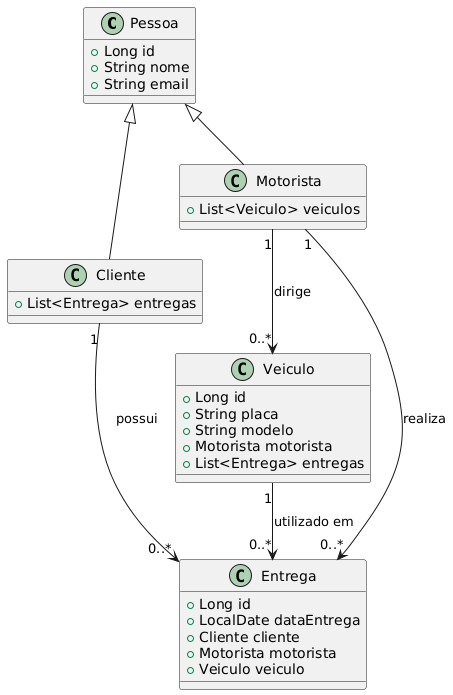

# ProjetoLPOOE1_Felipe_Seganfredo
Projeto da disciplina de LPOO - 4° Semestre CC IFSul.

Aqui está a documentação em Markdown para o projeto, atendendo aos requisitos do enunciado:


## Índice

- [Descrição do Projeto](#descrição-do-projeto)
- [Configuração do Ambiente](#configuração-do-ambiente)
- [Modelagem de Entidades](#modelagem-de-entidades)
- [Configuração do Banco de Dados](#configuração-do-banco-de-dados)
- [Mapeamento JPA](#mapeamento-jpa)
- [Configuração de Persistência](#configuração-de-persistência)
- [Execução do Projeto](#execução-do-projeto)
- [Teste JUnit](#teste-junit)
- [Requisitos Atendidos](#requisitos-atendidos)

---

## Descrição do Projeto

Este projeto visa criar um sistema de gestão para uma transportadora utilizando Java, JDBC e JPA para interagir com um banco de dados PostgreSQL. Desenvolvido para a disciplina de **Linguagem de Programação Orientada a Objetos (LPOO)**, ele tem como objetivos:
- Gerenciar entidades principais, como `Cliente`, `Motorista`, `Veículo`, e `Entrega`.
- Criar e manter relacionamentos entre as entidades no banco de dados, que é configurado automaticamente através das anotações JPA.

## Configuração do Ambiente

### Requisitos
- **Java 8+**
- **PostgreSQL**
- **NetBeans** (ou outra IDE com suporte a Maven)
- **Maven**

### Passos de Configuração

1. Clone este repositório do GitHub:
   ```bash
   https://github.com/FelipeFontanaSeganfredo/ProjetoLPOOE1_Felipe_Seganfredo.git
   ```

2. Configure o banco de dados PostgreSQL:
   - Crie um banco de dados chamado `ProjetoLPOOE1_Felipe_Seganfredo`.

3. Crie as variáveis de ambiente para `DB_USER` e `DB_PASSWORD` com as credenciais do seu banco de dados PostgreSQL.

4. Abra o projeto no NetBeans (ou outra IDE) e sincronize as dependências com o Maven.

## Modelagem de Entidades

As entidades principais são:

- **Cliente**: representa o cliente da transportadora.
- **Motorista**: representa o motorista responsável pelas entregas.
- **Veículo**: representa o veículo utilizado nas entregas.
- **Entrega**: representa a entrega de produtos ao cliente.

### Diagrama UML


## Configuração do Banco de Dados

As tabelas do banco de dados são criadas automaticamente pelo Hibernate com base nas anotações JPA. As configurações incluem:

- Padrão de nomes para tabelas, como `tb_cliente`, `tb_motorista`, `tb_veiculo`, e `tb_entrega`.
- Limitação de caracteres para campos de texto usando anotações JPA.
- Relacionamentos entre as classes:
  - `Cliente` e `Entrega`: **@OneToMany**
  - `Motorista` e `Veículo`: **@OneToMany**
  - `Entrega` e as demais classes: **@ManyToOne**

## Mapeamento JPA

Cada entidade é anotada com **@Entity** e mapeada para uma tabela com **@Table**. O mapeamento JPA inclui:

- **@OneToMany** e **@ManyToOne** para modelar os relacionamentos entre `Cliente`, `Motorista`, `Veículo`, e `Entrega`.
- As propriedades **@Column** especificam limites de caracteres e restrições de nulidade.

## Configuração de Persistência

O arquivo `persistence.xml` contém as configurações para conectar o Hibernate ao PostgreSQL:

```xml
<persistence-unit name="TransportadoraPU" transaction-type="RESOURCE_LOCAL">
    <provider>org.hibernate.jpa.HibernatePersistenceProvider</provider>
    <class>com.mycompany.transportadora.Pessoa</class>
    <class>com.mycompany.transportadora.Cliente</class>
    <class>com.mycompany.transportadora.Motorista</class>
    <class>com.mycompany.transportadora.Veiculo</class>
    <class>com.mycompany.transportadora.Entrega</class>
    <properties>
        <property name="javax.persistence.jdbc.url" value="jdbc:postgresql://localhost:5432/Projeto_LPOOE1_Felipe_Seganfredo"/>
        <property name="javax.persistence.jdbc.user" value="${DB_USER}"/>
        <property name="javax.persistence.jdbc.password" value="${DB_PASSWORD}"/>
        <property name="javax.persistence.jdbc.driver" value="org.postgresql.Driver"/>
        <property name="hibernate.dialect" value="org.hibernate.dialect.PostgreSQLDialect"/>
        <property name="hibernate.hbm2ddl.auto" value="create-drop"/>
        <property name="hibernate.show_sql" value="true"/>
        <property name="hibernate.format_sql" value="true"/>
    </properties>
</persistence-unit>
```

## Execução do Projeto

1. **Criar e persistir as entidades**: Utilize a classe `Transportadora` para criar e persistir as entidades `Cliente`, `Motorista`, `Veículo` e `Entrega`.
2. **Exibir as consultas SQL**: Durante a execução, as consultas SQL serão exibidas no console, facilitando o acompanhamento das operações realizadas.

## Teste JUnit

O projeto inclui um teste JUnit na classe `TransportadoraTeste`, que testa a persistência das entidades:

```java
import static org.junit.jupiter.api.Assertions.assertNotNull;
import org.junit.jupiter.api.Test;

public class TransportadoraTeste {
    @Test
    public void testPersistenciaDeEntidades() {
        Cliente cliente = new Cliente();
        cliente.setNome("João da Silva");
        cliente.setEmail("joao.silva@example.com");
        em.persist(cliente);
        
        Motorista motorista = new Motorista();
        motorista.setNome("Carlos Souza");
        motorista.setEmail("carlos.souza@example.com");
        em.persist(motorista);

        Veiculo veiculo = new Veiculo();
        veiculo.setPlaca("ABC-1234");
        veiculo.setModelo("Caminhão Ford");
        veiculo.setMotorista(motorista);
        em.persist(veiculo);

        Entrega entrega = new Entrega();
        entrega.setDataEntrega(LocalDate.now());
        entrega.setCliente(cliente);
        entrega.setMotorista(motorista);
        entrega.setVeiculo(veiculo);
        em.persist(entrega);
        
        em.getTransaction().commit();
        
        assertNotNull(entrega.getId());
    }
}
```

Este teste persiste uma instância de cada entidade e verifica a criação da `Entrega`.

## Requisitos Atendidos

1. **Configuração do Projeto**
   - Estrutura do repositório organizada e versionada no GitHub.
   - Arquivo `pom.xml` com as dependências e configurações de persistência.

2. **Modelagem e Mapeamento JPA**
   - As classes `Cliente`, `Motorista`, `Veículo`, e `Entrega` representam o domínio do projeto.
   - Relacionamentos mapeados adequadamente.
   - A herança de `Pessoa` é modelada com `Cliente` e `Motorista` como subclasses.

3. **Configuração de Persistência**
   - Arquivo `persistence.xml` configurado com `create-drop`.
   - Consultas SQL exibidas no console.

4. **Teste JUnit**
   - Teste implementado para persistência das entidades e dos relacionamentos.


